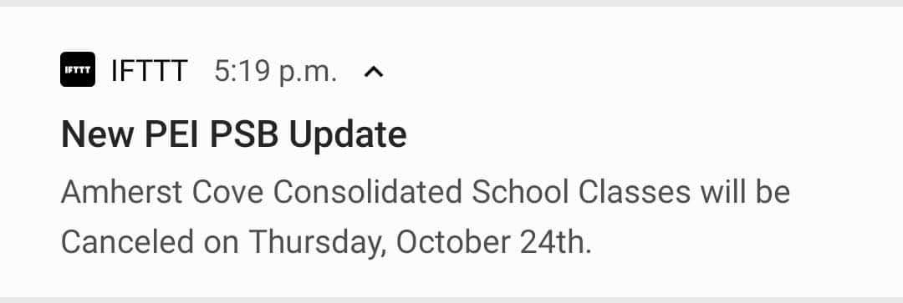
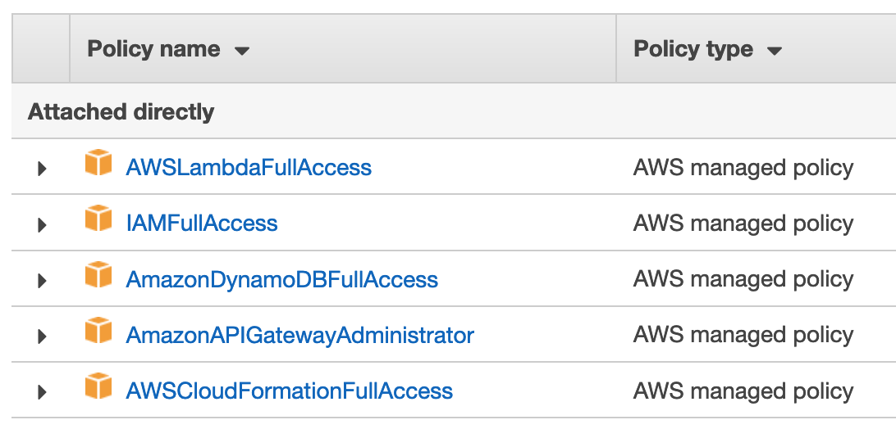

# Snow Day Notifier

<a href="https://gitlab.com/nfriend/snow-day-notifier/pipelines" target="_blank"></a>

A small [Lambda](https://aws.amazon.com/lambda/) function that scrapes [PEI's public schools website](https://edu.princeedwardisland.ca/psb/)
and sends alerts (through [IFTTT](https://ifttt.com/)) if school is delayed or closed.


Deployment of the Lambda function is managed by [GitLab CI/CD](https://docs.gitlab.com/ee/ci/) and the [Serverless framework](https://serverless.com/).
(See this project's [`.gitlab-ci.yml`](./.gitlab-ci.yml) and [`serverless.yml`](./serverless.yml).)
This function is scheduled to run every 5 minutes.

When the Lambda function identifies a potential closure, it sends a mobile notification that looks like this:



Clicking the notification redirects the user to the [PEI public schools website](https://edu.princeedwardisland.ca/psb/) to view the full post.

## Developing

1. Clone this repo: `git clone git@gitlab.com:nfriend/snow-day-notifier.git`
1. Install dependencies: `cd snow-day-notifier && npm install`
1. Run any of the scripts found in this project's `package.json`, for example: `npm run build:watch`

## Deploying

1. `git push` on `master`

## Project setup

This project expect a few CI/CD variables to be in place:

1. `AWS_ACCESS_KEY_ID`: The access key ID of your AWS IAM user
1. `AWS_SECRET_ACCESS_KEY`: The secret access key of your AWS IAM user
1. `IFTTT_KEY_JSON_ARRAY`: A JSON-formatted array of all [IFTTT Webhook keys](https://help.ifttt.com/hc/en-us/articles/115010230347-Webhooks-service-FAQ) that should be notified if a delay is detected. For example:

   ```json
   ["ifttt-key-1", "ifttt-key-2"]
   ```

1. `AWS_DYNAMO_REGION`: The AWS region of your IAM user (e.g. `ca-central-1`) for usage when setting up a DynamoDB connection

### IAM User

When creating the IAM user for this project, grant the user the following permissions:

- `AWSLambdaFullAccess`
- `IAMFullAccess`
- `AmazonDynamoDBFullAccess`
- `AnazonAPIGatewayAdministrator`
- `AWSCloudFormationFullAccess`


